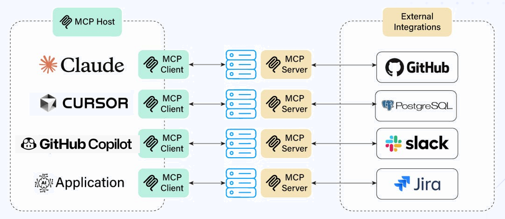

## 📁 Project Structure

```
mcp-jira-server/
├── server.js            # Main MCP server implementation
├── package.json         # Node.js dependencies and scripts
├── .env                 # JIRA credentials (create this file)
├── .env.example         # Template for environment variables
├── .gitignore           # Protects sensitive files from git
├── .git/                # Git repository data
├── .vscode/             # VS Code configuration
│   └── mcp.json         # MCP server configuration for VS Code
├── images/              # Project images (for documentation)
│   ├── JIra MCP.png     # JIRA MCP diagram
│   └── MCP.png          # MCP analogy diagram
└── README.md            # This file
```

## 🔧 File Explanations

### `server.js` - Core MCP Server
The main server file that implements the **Model Context Protocol**:
- **MCP Protocol Handler**: Manages communication with AI assistants
- **JIRA API Integration**: Connects to JIRA using REST APIs
- **Tool Definitions**: Defines available tools (create ticket, query tickets, etc.)
- **Stdio Transport**: Uses stdin/stdout for communication with VS Code

**Key components:**
- `JiraMCPServer` class - Main server logic
- `setupToolHandlers()` - Registers available tools with AI assistants
- Individual tool methods (`createJiraTicket`, `getJiraTickets`, etc.)

### `package.json` - Dependencies & Scripts
Defines project metadata and dependencies:
- **MCP SDK**: `@modelcontextprotocol/sdk` for MCP protocol implementation
- **HTTP Client**: `axios` for JIRA API calls
- **Environment Variables**: `dotenv` for secure credential management
- **Scripts**: `npm start` to run the server

### `.env` - Secure Configuration
Contains sensitive JIRA credentials (⚠️ **never commit this file**):
```bash
JIRA_BASE_URL=https://yourcompany.atlassian.net
JIRA_EMAIL=your-email@example.com
JIRA_API_TOKEN=your-api-token
JIRA_PROJECT_KEY=YOUR_PROJECT_KEY
```

### `.env.example` - Configuration Template
A safe template showing required environment variables without exposing actual credentials.

### `.vscode/mcp.json` - VS Code Integration
Configures the MCP server for use with VS Code and GitHub Copilot:
- Tells VS Code how to start the server
- Enables Agent mode integration
- Allows natural language interaction with JIRA

## What is MCP?

**Model Context Protocol (MCP)** is a standard that lets AI assistants (like GitHub Copilot) connect and interact with external tools and resources. It allows AI to discover, use, and manage actions or data.



## JIRA MCP Server

A Model Context Protocol (MCP) server that enables **bi-directional communication** between AI assistants (like GitHub Copilot) and JIRA, allowing you to create, query, and manage JIRA tickets through natural language interactions.

```
┌─────────────────────┐    ┌─────────────────────┐    ┌───────────────────┐
│  GitHub Copilot     │    │  Your MCP Server    │    │ JIRA REST API     │
│  (THE CLIENT)       │◄──►│  (THE SERVER)       │◄──►│ (THE SERVICE)     │
│   - The Brain       │    │   - The Translator  │    │  - GET            │
│   - Decides tools   │    │   - Tool executor   │    │  - POST           │ 
│   - Fills schemas   │    │   - Format handler  │    │  - PUT            │
└─────────────────────┘    └─────────────────────┘    └───────────────────┘

```
#### CLIENT (GitHub Copilot)
- **The Brain** that interprets user natural language
- **Decides which tools to use** based on user intent
- **Fills in the input schemas** with extracted parameters
- **Calls your server** with structured requests
- **Presents responses** back to the user in readable format

#### SERVER (Your MCP Server)
- **Tool registry** - tells client what tools are available
- **Parameter validator** - ensures inputs match schemas
- **tool executor** - implements the actual operations
- **Format translator** - converts between MCP format and JIRA API format

## 🎯 What This Project Does

This MCP server acts as a **bridge** between AI assistants and JIRA, enabling:

- ✅ **Create JIRA tickets** through AI chat
- ✅ **Query and search tickets** with natural language
- ✅ **Update ticket status** and properties
- ✅ **Add comments** to existing tickets
- ✅ **Get detailed ticket information**
- ✅ **List projects** and browse JIRA data


## 🔄 How Bi-directional Communication Works

### Outbound: AI → JIRA (Commands & Actions)

**User Input**: *"Create a JIRA ticket for creating a login feature on the UI"*

1. **GitHub Copilot (client)** receives natural language request
2. **Client** decides to use `create_jira_ticket` tool and fills the input schema
3. **Server** receives structured parameters from Client and calls the `create_jira_ticket` tool:
   ```json
   {
     "summary": "Add login auth in UI",
     "description": "Add login authentication using Supabase on the UI",
     "issueType": "Task",
     "priority": "High"
   }
   ```
5. **Server** makes HTTP call to JIRA REST API
6. **JIRA** creates the ticket and returns ticket ID
7. **Server** formats response for AI
8. **Client** presents success message to user

### Inbound: JIRA → AI (Data & Information)

**User Input**: *"Show me all tickets assigned to John"*

1. **Client** recognizes this as a query request
2. **Server** calls `get_jira_tickets` tool
3. **Server** receives query parameters:
   ```json
   {
     "assignee": "john@company.com",
     "maxResults": 20
   }
   ```
4. **Server** queries JIRA REST API with JQL
5. **JIRA** returns ticket data (JSON)
6. **Server** processes and formats the data:
   ```json
   {
     "tickets": [
       {
         "key": "DEV-123",
         "summary": "Fix authentication bug",
         "status": "In Progress",
         "assignee": "John Smith"
       }
     ]
   }
   ```
7. **Client** presents human-readable results to user


## 🔬 Key Code Snippets of server.js

### Core Dependencies and Configuration

```javascript
#!/usr/bin/env node

import { Server } from '@modelcontextprotocol/sdk/server/index.js';
import { StdioServerTransport } from '@modelcontextprotocol/sdk/server/stdio.js';
import {
  CallToolRequestSchema,
  ListToolsRequestSchema,
} from '@modelcontextprotocol/sdk/types.js';
import axios from 'axios';
import { config } from 'dotenv';
```

- **MCP SDK imports** - Core protocol implementation
- **Schema imports** - CallToolRequestSchema and ListToolsRequestSchema
- **axios** - HTTP client for JIRA API calls
- **dotenv** - Environment variable management for security

### JIRA Client Configuration

```javascript
const JIRA_CONFIG = {
  baseURL: process.env.JIRA_BASE_URL,
  auth: {
    username: process.env.JIRA_EMAIL,
    password: process.env.JIRA_API_TOKEN  // Basic Auth with API token
  },
  headers: {
    'Accept': 'application/json',
    'Content-Type': 'application/json'
  }
};

const jiraClient = axios.create(JIRA_CONFIG);
```
- **Basic Authentication** - JIRA uses email + API token
- **JSON headers** - expected input and output format (i.e., JSON)
- **JiraClient** - Jira API connection client (POST, GET, PUT)

### MCP Server Class Architecture

```javascript
class JiraMCPServer {
  constructor() {
    this.server = new Server(
      {
        name: 'jira-mcp-server',
        version: '0.1.0',
      },
      {
        capabilities: {
          tools: {},  // We provide tools capability
        },
      }
    );

    this.setupToolHandlers();
    this.setupErrorHandling();
  }
}
```
- **Server metadata** - Identity for MCP protocol
- **Capabilities declaration** - Tells clients what we support
- **Separation of concerns** - Setup methods handle different aspects

### Tool Registration: The Contract Definition

The heart of MCP is the tool registration system. This is where you define **THE CONTRACT** between the AI client and your server:

```javascript
this.server.setRequestHandler(ListToolsRequestSchema, async () => {
  return {
    tools: [
      {
        name: 'create_jira_ticket',
        description: 'Create a new JIRA ticket',
        inputSchema: {
          type: 'object',
          properties: {
            summary: {
              type: 'string',
              description: 'Ticket title/summary',
            },
            description: {
              type: 'string',
              description: 'Ticket description',
            },
            issueType: {
              type: 'string',
              description: 'Issue type (Task, Bug, Story, Epic)',
              default: 'Task',
            },
            priority: {
              type: 'string',
              description: 'Priority (Highest, High, Medium, Low, Lowest)',
              default: 'Medium',
            },
          },
          required: ['summary', 'description'],
        },
      },
      // ... more tools
    ],
  };
});
```

1. **Tool Discovery** - Client asks "what can you do?"
2. **JSON Schema Definition** - Precise parameter specifications
3. **Required vs Optional** - Client knows what MUST be provided
4. **Type Safety** - Client validates before calling
5. **Self-Documentation** - Descriptions guide AI understanding

**The Client Uses This To:**
- Understand available operations
- Extract parameters from natural language
- Validate inputs before making calls

### Tool Execution

```javascript
this.server.setRequestHandler(CallToolRequestSchema, async (request) => {
  const { name, arguments: args } = request.params;

  try {
    switch (name) {
      case 'create_jira_ticket':
        return await this.createJiraTicket(args);
      case 'get_jira_tickets':
        return await this.getJiraTickets(args);
      // ... other cases
      default:
        throw new Error(`Unknown tool: ${name}`);
    }
  } catch (error) {
    return {
      content: [
        {
          type: 'text',
          text: `Error executing ${name}: ${error.message}`,
        },
      ],
      isError: true,
    };
  }
});
```

**Execution Flow:**
1. **Client sends** structured request with tool name + arguments
2. **Server validates** tool exists
3. **Server executes** corresponding method
4. **Error handling** catches any failures
5. **Response formatting** standardizes output

### Data Flow Example: Creating a Ticket

```
User: "Create a new ticket for addition of authentication on the UI with high priority"

1. CLIENT (Copilot) Analysis:
   - Intent: create_jira_ticket
   - Parameters extracted:
     * summary: "Login feature"
     * issueType: "Task" 
     * priority: "High"
     * description: (inferred/asked for)

2. CLIENT → SERVER Request:
   {
     "name": "create_jira_ticket",
     "arguments": {
       "summary": "Login feature",
       "description": "Addition of authentication feature on UI",
       "issueType": "Task",
       "priority": "High"
     }
   }

3. SERVER Processing:
   - Validates against inputSchema
   - Calls this.createJiraTicket(args)
   - Transforms to JIRA API format
   - Makes HTTP POST to JIRA

4. SERVER → JIRA Request:
   POST /rest/api/3/issue
   {
     "fields": {
       "project": {"key": "DEV"},
       "summary": "Login feature",
       "description": { /* ADF format */ },
       "issuetype": {"name": "Task"},
       "priority": {"name": "High"}
     }
   }

5. JIRA → SERVER Response:
   {
     "id": "10001",
     "key": "DEV-123",
     "self": "https://company.atlassian.net/rest/api/3/issue/10001"
   }

6. SERVER → CLIENT Response:
   {
     "content": [{
       "type": "text", 
       "text": "✅ Successfully created JIRA ticket!\n🎫 Key: DEV-123..."
     }]
   }

7. CLIENT → USER Display:
   "I've created ticket DEV-123 for the login feature. You can view it at..."
```

### HTTP Methods: Understanding GET, POST, PUT

#### GET Requests - Data Retrieval
```javascript
// GET /rest/api/3/search - Query tickets
const response = await jiraClient.get('/rest/api/3/search', {
  params: {
    jql: searchJql,
    maxResults: maxResults,
    fields: 'key,summary,status,assignee'
  }
});

// GET /rest/api/3/issue/{ticketKey} - Get specific ticket
const response = await jiraClient.get(`/rest/api/3/issue/${ticketKey}`, {
  params: { fields, expand: includeHistory ? 'changelog' : '' }
});
```

#### POST Requests - Creation & Actions
```javascript
// POST /rest/api/3/issue - Create new ticket
const response = await jiraClient.post('/rest/api/3/issue', issueData);

// POST /rest/api/3/issue/{key}/transitions - Change status
await jiraClient.post(`/rest/api/3/issue/${ticketKey}/transitions`, {
  transition: { id: transition.id }
});
```

#### PUT Requests - Updates & Replacement
```javascript
// PUT /rest/api/3/issue/{key} - Update ticket fields
await jiraClient.put(`/rest/api/3/issue/${ticketKey}`, updateData);
```

### Dual Strategy Implementation:
```javascript
let searchJql = jql;  // Accept direct JQL
if (!searchJql) {
  // Build JQL from simple filters for non-technical users
  const conditions = [];
  // ... build conditions
  searchJql = conditions.join(' AND ');
}
```

This approach serves both:
- **Power users** who can write complex JQL directly
- **Simple users** who get natural language → filter conversion


## 🚀 Setup Instructions

### Prerequisites
- **Node.js 18+** - [Download here](https://nodejs.org/)
- **VS Code** with **GitHub Copilot** extension
- **JIRA account** with API access

### Step 1: Clone and Install

```bash
# Clone the repository (or download the files)
git clone https://github.com/mingxiuuuuu/Jira-MCP-Server.git
cd mcp-jira-server

# Install dependencies
npm install
```

### Step 2: Configure JIRA Credentials

1. **Copy the environment template:**
   ```bash
   cp .env.example .env
   ```

2. **Get your JIRA API token:**
   - Go to: https://id.atlassian.com/manage-profile/security/api-tokens
   - Click "Create API token"
   - Copy the generated token

3. **Edit `.env` file** with your actual JIRA details:
   ```bash
   JIRA_BASE_URL=https://yourcompany.atlassian.net
   JIRA_EMAIL=your-email@example.com
   JIRA_API_TOKEN=your-api-token-here
   JIRA_PROJECT_KEY=YOUR_PROJECT_KEY
   ```

4. **Find your project key:**
   - Look at any JIRA ticket URL: `https://company.atlassian.net/browse/PROJ-123` → Key is `PROJ`
   - Or check your project settings in JIRA

### Step 3: Configure VS Code

#### Method A: Using VS Code Commands (Recommended)

1. **Open VS Code**
2. **Press** `Ctrl+Shift+P` (Windows/Linux) or `Cmd+Shift+P` (macOS)
3. **Type:** `MCP: Add Server`
4. **Fill in details:**
   - **Name:** `jira`
   - **Command:** `node`
   - **Arguments:** `server.js`
   - **Working Directory:** `/absolute/path/to/your/mcp-jira-server`
5. **Choose:** "Global" (available in all projects)
6. **Restart VS Code**
7. `Ctrl+Shift+P`, type **MCP: List Servers**, select "jira" server and click "Start"

#### Method B: Manual Configuration

Create `.vscode/mcp.json` in your project root:

```json
{
  "servers": {
    "jira": {
      "type": "stdio",
      "command": "node",
      "args": ["server.js"]
    }
  }
}
```

### Step 4: Enable Agent Mode

1. **Open VS Code Settings** (`Ctrl+,`)
2. **Search for:** `chat.agent.enabled`
3. **Check the box** ✅
4. **Restart VS Code**

### Step 5: Test Integration

1. **Open GitHub Copilot Chat** (click chat icon in sidebar)
2. **Select "Agent" mode** from dropdown
3. **Test commands:**
   ```
   What JIRA tools do you have available?
   ```
   ```
   Create a JIRA ticket for creating the login feature
   ```
   ```
   Show me all tickets assigned to me
   ```
### Optional: How to add Jira MCP server to your repository for seamless ticket management and development? 
 
Add the mcp.json file to your repository and change to the absolute path where the server.js file of the jira mcp server lies and add server like before. You are then set to access Jira on the go without having to leave your development environment!

 ```
{
  "servers": {
    "jira": {
      "type": "stdio",
      "command": "node",
      "args": ["<change this to the absolute path to server.js of the jira mcp server>"]
    }
  }
}
 ```

## 🎯 Usage Examples

Once set up, you can interact with JIRA through natural language in VS Code:

### Creating Tickets
```
"Create a JIRA ticket called 'Add authentication features to UI' with high priority"
```

### Querying Tickets
```
"List all high-priority ticket in the current sprint"
"What tickets are in 'In Progress' status?"
```

### Updating Tickets
```
"Update ticket SCRUM-29 status to 'Done'"
"Add a comment to SCRUM-20 saying 'To be reviewed by project sponsor'"
```

### Getting Information
```
"Get details for ticket SCRUM-16"
"Show me all available JIRA projects"
"What's the current status of ticket SCRUM-8?"
```

## 🚨 Troubleshooting

### Common Issues

**"Server failed to start"**
- Check your absolute path is correct
- Verify Node.js is installed: `node --version`
- Ensure dependencies are installed: `npm install`

**"JIRA connection failed"**
- Verify credentials in `.env` file
- Test JIRA URL in browser
- Check API token is valid

**"No tools available"**
- Ensure Agent mode is enabled in VS Code
- Check `MCP: List Servers` shows "Connected"
- Restart VS Code after configuration changes


### Getting Help

1. **Check server output:** `MCP: List Servers → Show Output`
2. **Verify JIRA connection:** Run manual test commands above
3. **Check VS Code console:** Help → Toggle Developer Tools
4. **Test tools individually:** Use `#tool_name` in Agent mode


